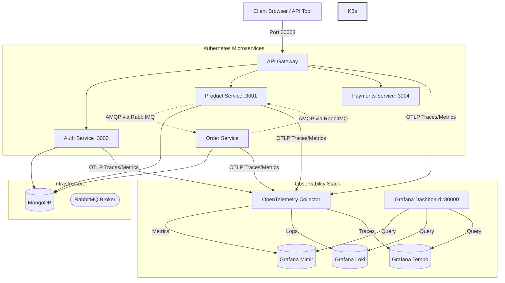

# Node.js E-Commerce Microservices

A production-grade, event-driven e-commerce backend built with Node.js and Express, designed using Uncle Bob's **Clean Architecture**, orchestrated with **Kubernetes**, and monitored using a unified **LGTM Observability Stack** and **OpenTelemetry**.

---

## 🏗️ Software Architecture



### Key Architectural Highlights
*   **API Gateway:** Binds all services behind a single entrypoint. Proxies request paths to `/auth`, `/products`, `/orders`, and `/payments`.
*   **Asynchronous Messaging:** Loose coupling between `product` and `order` services is achieved through **RabbitMQ** (using `orders` and `products` queues), saving REST overhead and preventing database locking.
*   **Clean Architecture:** Modularity, dependency inversion, and strict boundary separation applied to the Express microservices.
*   **Persistent Storage:** Configured persistent storage volumes (PVCs) for stateful applications (MongoDB) to survive pod rescheduling.
*   **Distributed Tracing & Metrics:** Active tracing across services via **OpenTelemetry** to trace requests (e.g. from API Gateway ➔ Auth ➔ Product ➔ RabbitMQ ➔ Order).

---

## 🛠️ Tech Stack
*   **Backend:** Node.js, Express, Mongoose
*   **Message Broker:** RabbitMQ (AMQP)
*   **Database:** MongoDB
*   **Container Orchestration:** Kubernetes (K8s)
*   **Observability (LGTM Stack):** Grafana, Loki (Logs), Mimir (Metrics), Tempo (Traces)
*   **Telemetry Agent:** OpenTelemetry Collector (OTel)
*   **Load Testing:** Autocannon

---

## 🚀 Getting Started

### Prerequisites
*   [Docker Desktop](https://www.docker.com) with **Kubernetes** enabled (or a local `kind` / `minikube` cluster)
*   [Node.js](https://nodejs.org) (v18+ recommended)
*   `kubectl` CLI

---

### Running on Kubernetes (Recommended)

All Kubernetes manifests are organized under the [/k8s](file:///c:/Users/gurun/Documents/LEARNING/Amazonn/k8s) folder:

#### 1. Deploy Infrastructure (MongoDB & RabbitMQ)
```bash
kubectl apply -f k8s/infra/
```

#### 2. Deploy Observability Stack (Grafana, Loki, Mimir, Tempo, OTel Collector)
```bash
kubectl apply -f k8s/observability/
```

#### 3. Deploy Application Microservices
```bash
kubectl apply -f k8s/apps/
```

#### 4. Verify Deployments
Ensure all pods are in the `Running` and `READY 1/1` state:
```bash
kubectl get pods
```

---

### Port Mappings & Dashboard Access

Since NodePorts are exposed on the virtual cluster nodes, you should port-forward services to access them from your local browser:

| Component | Port-Forward Command | Browser URL | Default Credentials |
| :--- | :--- | :--- | :--- |
| **Grafana Dashboard** | `kubectl port-forward service/grafana 3000:3000` | [http://localhost:3000](http://localhost:3000) | Username: `admin` / Password: `admin` |
| **RabbitMQ Management UI** | `kubectl port-forward service/rabbitmq 15672:15672` | [http://localhost:15672](http://localhost:15672) | Username: `guest` / Password: `guest` |
| **API Gateway** | `kubectl port-forward service/api-gateway 3003:3003` | [http://localhost:3003](http://localhost:3003) | *API Entrypoint* |

---

## ⚡ Performance & Load Testing

We have built-in scripts in the [/scripts](file:///c:/Users/gurun/Documents/LEARNING/Amazonn/scripts) directory to perform performance and load testing against your running endpoints:

Make sure you have port-forwarded the API Gateway:
```bash
kubectl port-forward service/api-gateway 3003:3003
```

### 1. Autocannon Load Testing
Requires installing `autocannon` dependency (`npm install` in root). Supports benchmarking different pathways (e.g. `login`, `products`, `buy`):
```bash
# Run products retrieval stress test
node scripts/loadTest.js --gateway=http://localhost:3003 --scenario=products --duration=10 --connections=50

# Run checkout flow test (Exercises RabbitMQ & DB)
node scripts/loadTest.js --gateway=http://localhost:3003 --scenario=buy --duration=15 --connections=10
```

### 2. Zero-Dependency Performance Check
Runs concurrent request batches using native Node.js:
```bash
# Usage: node scripts/perfTest.js <gateway_url> <total_requests> <concurrency>
node scripts/perfTest.js http://localhost:3003 100 10
```
