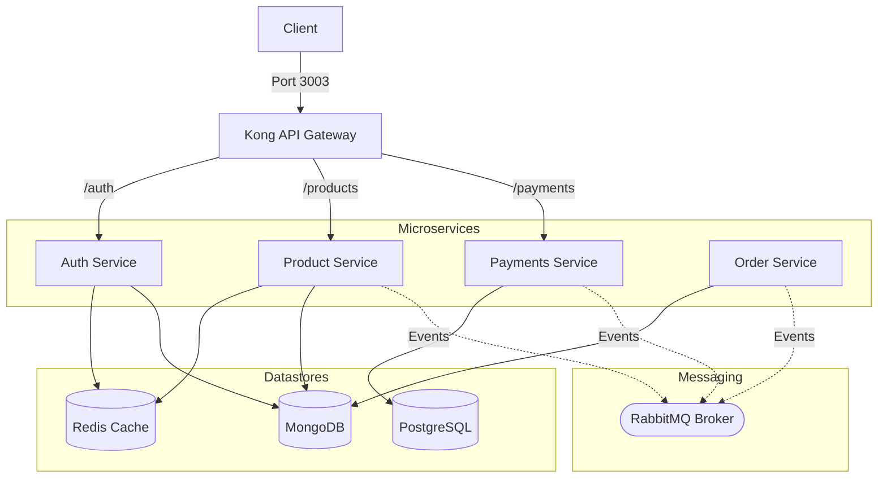

# Node.js E-Commerce Microservices

A production-grade, event-driven e-commerce backend built with Node.js and Express, designed using Uncle Bob's **Clean Architecture**, orchestrated with **Docker Compose**, and monitored using a unified **LGTM Observability Stack** and **OpenTelemetry**.

---

## 🏗️ System Architecture



### Key Architectural Highlights
*   **API Gateway (Kong OSS):** Routes requests to `/auth`, `/products`, and `/payments`. Configured with OpenTelemetry tracing plugins, CORS header controls, and global rate limiting.
*   **Polyglot Persistence:** Utilizes PostgreSQL for storing payment audit logs/transactions and MongoDB for storing user accounts, order details, and product catalog items.
*   **Redis Caching:** Accelerates read operations with a read-through and write-invalidate caching layer:
    *   **User POV:** User profiles are cached by username in the Auth service (`user:username:${username}`) with a 5-minute TTL.
    *   **Products Catalog:** The complete product catalog list is cached in the Product service (`products:all`) with a 1-hour TTL and invalidated upon product creation.
*   **Asynchronous Messaging (Topic Exchange & Quorum Queues):** Decoupled microservices communicate through RabbitMQ using a topic-based routing model under the exchange `ecommerce_exchange`. All queues (and their Dead Letter Queues) are configured as **Quorum Queues** to ensure enterprise-grade message replication and reliability.
*   **Distributed Tracing & Metrics:** OpenTelemetry instrumentation collects logs, metrics, and tracing spans from Kong Gateway, microservices, and databases, forwarding them to Grafana Mimir, Loki, and Tempo.

---

## 🛠️ Tech Stack
*   **Backend:** Node.js, Express, pg (PostgreSQL driver), Mongoose (MongoDB driver)
*   **API Gateway:** Kong OSS
*   **Caching & Datastores:** Redis, PostgreSQL, MongoDB
*   **Message Broker:** RabbitMQ (AMQP)
*   **Container Orchestration:** Docker Compose
*   **Observability (LGTM Stack):** Grafana, Loki (Logs), Mimir (Metrics), Tempo (Traces)
*   **Telemetry Agent:** OpenTelemetry Collector (OTel)

---

## 🚀 Getting Started

### Prerequisites
*   [Docker Desktop](https://www.docker.com) (or Docker Engine with Docker Compose plugin)
*   [Node.js](https://nodejs.org) (v18+ recommended) for local scripting and testing

---

### Running the Stack (Docker Compose)

The entire microservice stack, along with databases, message queues, caching nodes, and observability tooling, can be started with:

```bash
docker compose up --build -d
```

To stop the stack and preserve volumes:
```bash
docker compose down
```

To stop the stack and wipe all volumes (fresh database start):
```bash
docker compose down -v
```

---

### Port Mappings & Dashboard Access

All services are mapped directly to your localhost:

| Component | Port | Browser URL | Default Credentials |
| :--- | :--- | :--- | :--- |
| **Grafana Dashboard** | `3000` | [http://localhost:3000](http://localhost:3000) | Username: `admin` / Password: `admin` |
| **RabbitMQ Management UI** | `15672` | [http://localhost:15672](http://localhost:15672) | Username: `guest` / Password: `guest` |
| **Kong Manager OSS UI** | `8002` | [http://localhost:8002](http://localhost:8002) | *Dashboard / UI* |
| **Kong Proxy Gateway** | `3003` | [http://localhost:3003](http://localhost:3003) | *API Entrypoint* |
| **Redis Cache** | `6379` | `localhost:6379` | *Internal / Local access* |
| **PostgreSQL Database** | `5432` | `localhost:5432` | User: `payments_user` / DB: `payments_db` |

---

## ⚡ Performance Benchmarks & Testing

### 1. Redis Caching Benchmark Results (Measured Locally)
We measured the performance and memory overhead of the Redis caching container on standard hardware:
*   **SET Operations**: **9,619 requests/sec** (p50 latency: **0.31 ms**)
*   **GET Operations**: **8,110 requests/sec** (p50 latency: **0.30 ms**)
*   **Memory Footprint**:
    *   *Baseline*: `1.48 MB`
    *   *After 50,000 Keys*: `17.81 MB` (averaging **342 bytes** per cached user profile).
    *   *1M User + 100K Product Projection*: **~375.48 MB** total RAM footprint, proving high efficiency within a 512MB RAM container constraint.

### 2. API Gateway & Rate-Limiting Protection Results
Under a concurrent stress test of **754 requests** in 30 seconds:
*   Kong's rate limiter capped traffic to the specified **15 requests/second**.
*   **32 checkouts** completed successfully.
*   **345 requests** were safely rate-limited and blocked by Kong with a **`429 Too Many Requests`** status code, preventing microservice resource exhaustion.

---

## 🧪 Testing Locally

### E2E Load Generator
Exercises user registration, authentication, product seeding, cache-driven catalog fetching, and transaction checkouts under concurrent load:
```bash
node scripts/generateLoad.js
```

### LGTM Stack Health Verification
Checks that Mimir, Loki, Tempo, and Grafana are healthy and datasources are provisioned:
```bash
node scripts/verify-lgtm.js
```
